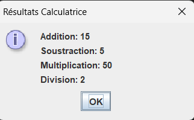
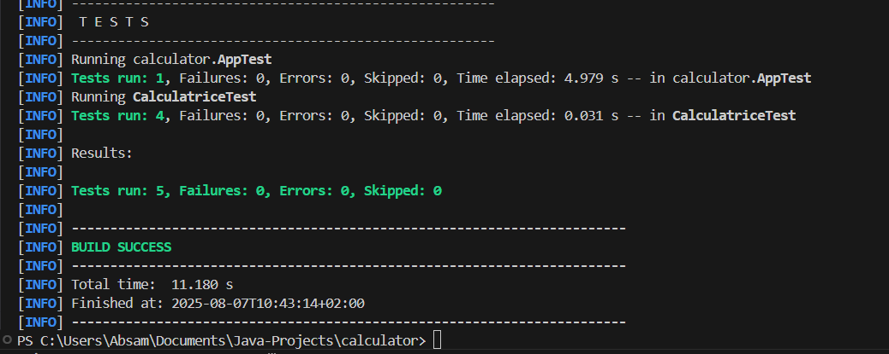

# 🧮 Java Calculator

This is a simple calculator written in Java, featuring:

- ✅ Basic operations: addition, subtraction, multiplication, division
- 🖥️ Graphical interface using **Swing**
- 🧪 Unit testing with **JUnit 5**
- 🧰 Built with **Maven** and compatible with Java 21+

## 📸 Preview




## ▶️ How to Run the App

Make sure you have **Java 21** and **Maven** installed.

```bash
git clone https://github.com/ton-pseudo/java-calculator.git
cd java-calculator
mvn compile exec:java -Dexec.mainClass="calculator.App"

## 🧪 Run Tests

```bash
mvn test

##📂 Project Structure

```bash
calculator/
├── src/
│   ├── main/java/calculator/
│   │   ├── App.java
│   │   └── Calculatrice.java
│   └── test/java/calculator/
│       └── CalculatriceTest.java
├── pom.xml
└── README.md
